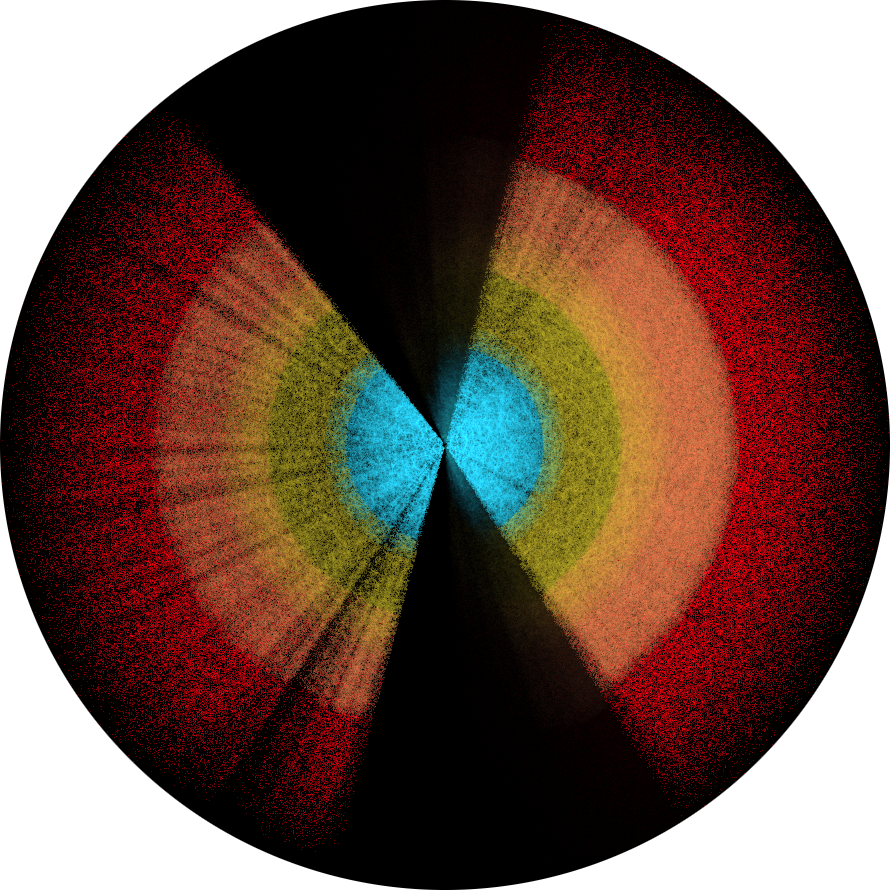
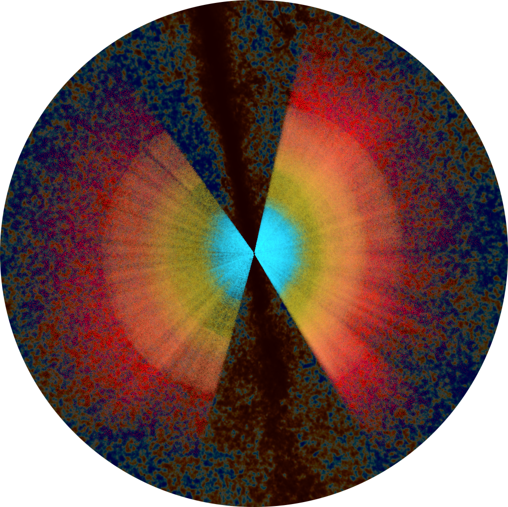
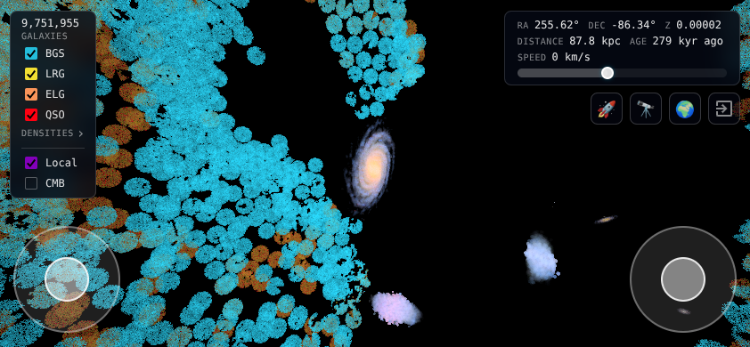

# Hollved
An interactive visualizer of the largest 3D maps of the Universe.

    <picture>
        <!--  -->
        
    </picture>
      
    <picture>
        
    </picture>

## Status
This work is currently in development. If you find it useful, consider sharing it, providing feedback, or starring ⭐ this GitHub repository.

## Features
* Visualize the evolution of spectroscopic surveys, that are mapping the Universe since the end of the 1970s.
* Orbit or fly-through the galaxies. Get a grasp on the greatness of cosmic scales, from the Milky-Way to the Cosmic Microwave Background (CMB) and the observable Universe.
* Look at survey footprints, the large-scale structures of the cosmic web, and redshift-space distortions like the finger of god effect.  

## Processing
* Datasets are downloaded from public databases. Some can require additional processing like quality cuts or population splits, which are detailed in their companion papers.
* Angular and redshift data are converted into 3D positions in comoving Mpc assuming [Planck2018](https://arxiv.org/pdf/1807.06209) fiducial cosmology.
* **Rendering millions of galaxies interactively requires careful performance trade-offs**, especially for mobile devices. Coordinates are stored as Float16 in binary files to minimise load times. On the rendering side, additive blending combined with generalized Reinhard luminance tone mapping eliminates the need for depth-buffer sorting, while maintaining some visual quality.
* Tracer densities are computed from Kernel Density Estimation (KDE) over comoving distances. In particular, redshift densities are computed by forwarding distance densities to avoid KDE over redshifts. Volume densities are compensated from tracer footprint to be meaningful, while radial densities are not.
* Local group galaxies are rendered by first obtaining pictures cleaned from foreground and background stars and dusts, and deprojected in case of spiral galaxies. Pictures are then randomly sampled and extruded according to alpha channel to provide thickness.
* For redshift-independent catalogs, luminosity distances are converted into comoving distances, again assuming [Planck2018](https://arxiv.org/pdf/1807.06209) fiducial cosmology, regardless of potential Hubble tensions.

## Acknowledgements
This work has been deeply inspired by Andrei Kashcha's [software package visualizer](https://github.com/anvaka/pm), Charlie Hoey's [Gaia DR1 rendering](https://cdn.charliehoey.com/threejs-demos/gaia_dr1.html), and Claire Lamman's [DESI visuals](https://cmlamman.github.io/science_art.html).

This work makes use of public data from multiple types and sources:
* Redshift catalogs:
	* [DESI](https://data.desi.lbl.gov/doc/acknowledgments/)
	* [Euclid](https://esdcdoi.esac.esa.int/doi/html/data/astronomy/euclid/eqrq1.html)
	* [Quaia](https://iopscience.iop.org/article/10.3847/1538-4357/ad1328)
	* [SDSS BOSS](https://www.sdss3.org/collaboration/boiler-plate.php), [SDSS eBOSS](https://www.sdss4.org/collaboration/#sdss4acknowledgement)
	* [SDSS Legacy](https://classic.sdss.org/collaboration/credits.php)
	* [2dFGRS](https://ui.adsabs.harvard.edu/abs/2003astro.ph..6581C/abstract)
	* [CfA1](https://ui.adsabs.harvard.edu/abs/1983ApJS...52...89H/abstract), [CfA2](https://iopscience.iop.org/article/10.1086/316343)
* CMB 100GHz map from [Planck](https://www.cosmos.esa.int/web/planck/planck-data-use).
* Main local group galaxy pictures: [M31](https://www.reddit.com/user/Correct_Presence_936/), [MW](https://www.esa.int/ESA_Multimedia/Images/2025/01/The_best_Milky_Way_map_by_Gaia), [M33](https://www.eso.org/public/images/eso1424a/), [LMC](https://www.esa.int/ESA_Multimedia/Images/2018/04/Large_Magellanic_Cloud), [SMC](https://www.esa.int/ESA_Multimedia/Images/2018/04/Small_Magellanic_Cloud), [M110](https://noirlab.edu/public/images/noao-m110/), [M32](https://pages.astronomy.ua.edu/gifimages/m32.html), [NGC 147](https://simbad.u-strasbg.fr/simbad/sim-id?Ident=NGC%20147), [NGC 185](https://simbad.u-strasbg.fr/simbad/sim-id?Ident=NGC+185), [NGC 6822](https://www.esa.int/Science_Exploration/Space_Science/Euclid/Euclid_s_view_of_irregular_galaxy_NGC_6822), [IC 1613](https://www.eso.org/public/images/eso1603a/), [IC 10](https://noirlab.edu/public/images/noirlab2013a/), [WLM](https://noirlab.edu/public/images/noao-wlm/).
* Redshift-independent distance catalog from [CF4](https://iopscience.iop.org/article/10.3847/1538-4357/ac94d8).

