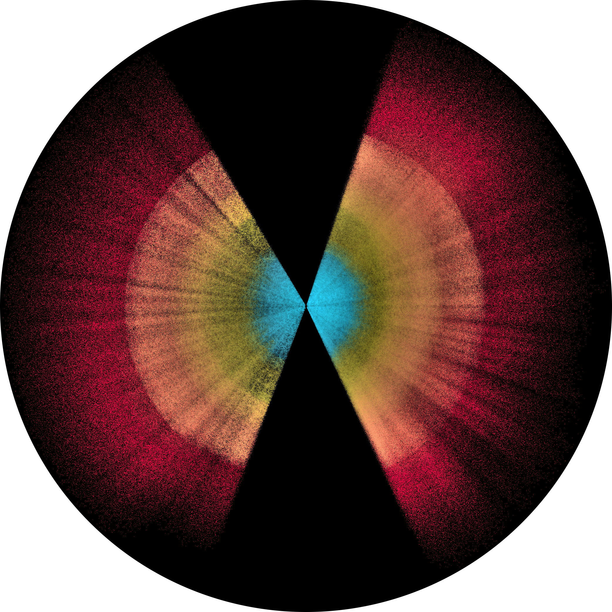

# Hollved
An interactive visualizer of the largest 3D maps of the Universe.

## Status
This project is currently in development. If you find it useful, consider sharing it, providing feedback, or starring ⭐ this GitHub repository.

## Processing
* After download from public databases, angular and redshift data are converted into 3D positions in comoving Mpc by using Planck18 fiducial cosmology. 
* Rendering millions of galaxies interactively requires careful performance trade-offs. Coordinates are stored as Int32 in binary files to minimise load times. On the rendering side, additive blending combined with generalized Reinhard luminance tone mapping eliminates the need for depth-buffer sorting, while maintaining some visual quality.

## Acknowledgements
This project has been deeply inspired by Andrei Kashcha's [software package visualizer](https://github.com/anvaka/pm), Charlie Hoey's [Gaia DR1 rendering](https://cdn.charliehoey.com/threejs-demos/gaia_dr1.html), and Claire Lamman's [DESI visuals](https://cmlamman.github.io/science_art.html).